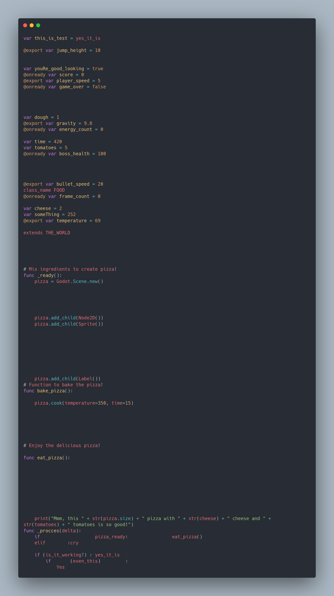
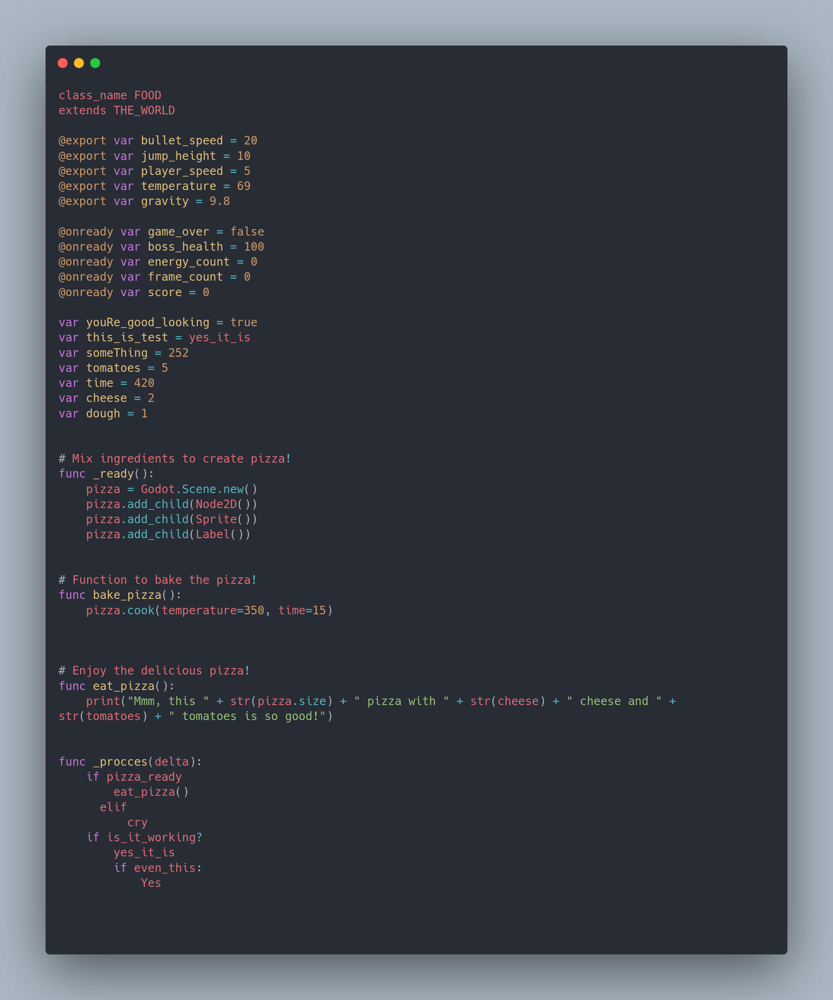

# Gdscript-Formatter.
This is my first time writing a formatter.  
Currently, it is missing a lot of features.  
Right now, it can only organize global variables and functions.

Before:

  

  After"

  
